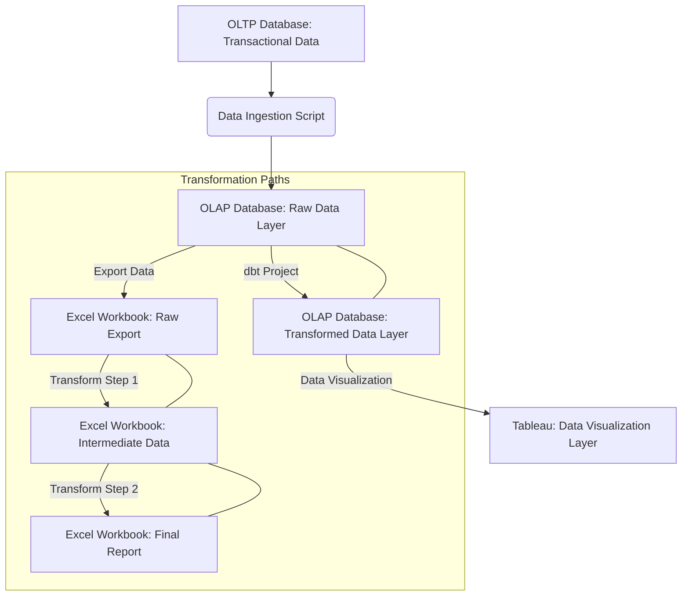

# OLTP to OLAP Data Movement & Transformation Demo

This project provides a quick demonstration of a common data architecture
pattern: moving data from an Online Transactional Processing (OLTP) database to
an Online Analytical Processing (OLAP) database for analytical purposes. It
further illustrates two distinct approaches for data transformation and
reporting: direct export to Excel for manual/scripted transformations, and
leveraging dbt (data build tool) for in-database transformations.

## 🚀 Features

- **OLTP to OLAP Data Ingestion**: Simulate moving data from a transactional
  source to an analytical data store.
- **Excel Export & Transformation**:
  - Export raw data from the OLAP database to an Excel workbook.
  - Demonstrate multi-step data transformations within Excel (e.g., using
    Python scripts to manipulate the Excel file).
- **fake/mock dbt for In-Database Transformation**:
  - Showcase how dbt can be used to build analytical models directly within the
    OLAP database.
  - Create materialized views or tables based on transformations, ensuring data
    consistency and reusability.

## 📊 Architecture

The following diagram illustrates the data flow and transformation paths within
this demo:



## 🛠️ Technologies Used

- **Python 3.13**: For data ingestion scripts and Excel automation.
- **uv**: Fast Python package installer and dependency manager.
- **OLTP Database**: (Placeholder - e.g., PostgreSQL, MySQL)
- **OLAP Database**: (Placeholder - e.g., DuckDB, Snowflake, BigQuery)
- **dbt (data build tool)**: For defining and running SQL transformations.
- **Microsoft Excel**: For external data manipulation and reporting.

## 🚀 Getting Started

### Prerequisites

- Python 3.13 installed.
- `uv` installed: `pip install uv` (or `python -m pip install uv`)
- Access to an OLTP database (e.g., a local PostgreSQL instance).
- Access to an OLAP database (e.g., a local DuckDB file or cloud warehouse credentials).
- Microsoft Excel (if running the Excel transformation path).

### Project Setup

1.  **Clone the repository:**

    ```bash
    git clone https://github.com/your-username/oltp-to-olap-demo.git
    cd oltp-to-olap-demo
    ```

2.  **Install Python dependencies:**

    ```bash
    uv sync
    source .venv/bin/activate
    ```


3.  **Seed Initial Data (OLTP):**
    Run the script to populate your OLTP database with sample data.
    ```bash
    python scripts/populate_oltp.py
    ```
